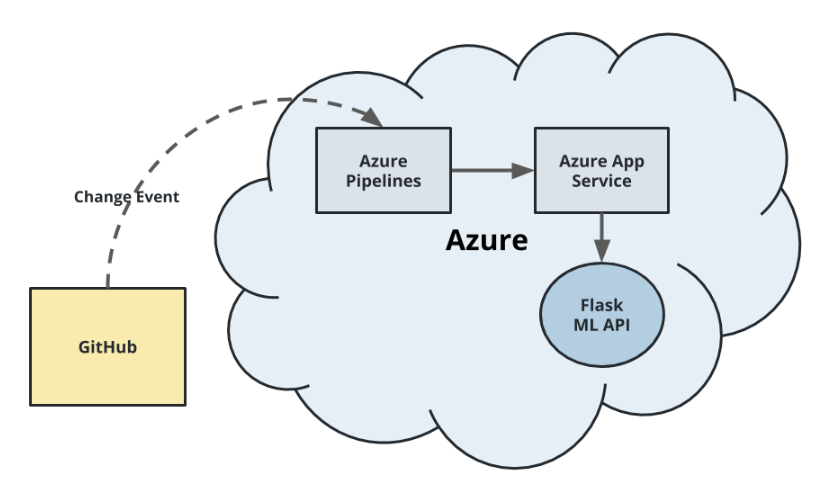
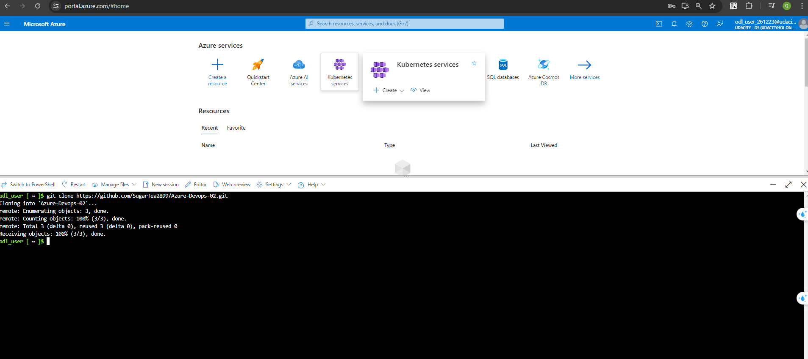
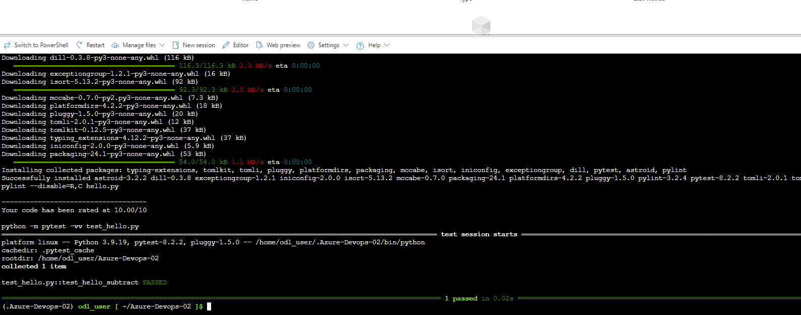

# Overview

In this project, the objective is to develop a new GitHub repository and establish a framework that facilitates Continuous Integration and Continuous Delivery processes. This involves leveraging GitHub Actions alongside a Makefile, requirements.txt, and application code to execute an initial cycle of linting, testing, and installation. Following this, integration with Azure Pipelines will be implemented to enable seamless Continuous Delivery to Azure App Service.

## Project Plan

* [Trello Board](https://trello.com/invite/b/loFkI2UW/ATTI272f5d231ca569dc6070650bd53ab1a33788C102/azure-devops02)
* [Spreadsheet](https://docs.google.com/spreadsheets/d/1EschlFGGEW0DlrWmW1snOHnNuIjOatBz2YLb9b5T-Ws/edit?usp=sharing)

## Instructions

### Could Shell
1. Clone Repo in Could Shell:

2. Run `make all`:

## Enhancements

- Enhancing test coverage by adding additional test cases.
- Developing a user interface for interactive prediction capabilities.
- Transitioning from Azure Pipelines to GitHub Actions - for CI/CD automation.
- Deploying the application on a Kubernetes cluster for scalable and resilient operation.

## Demo 

<TODO: Add link Screencast on YouTube>

